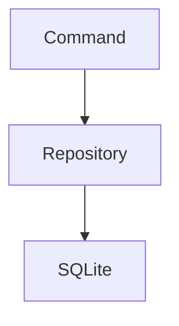
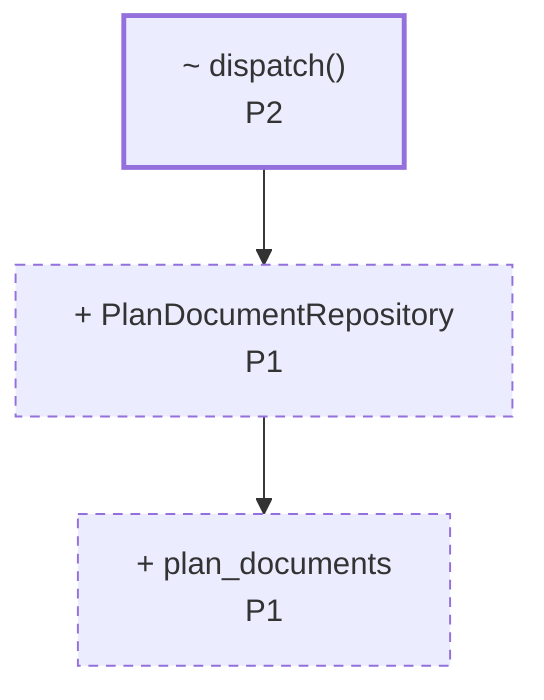
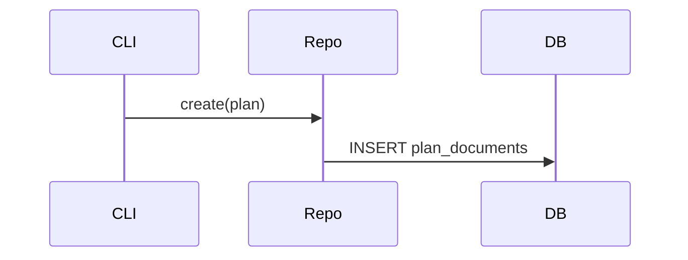
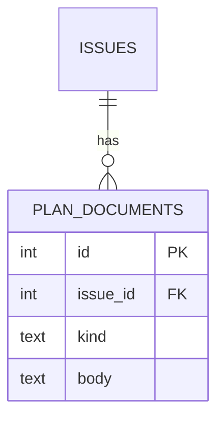

# Plan: <title>

> **Diagram convention (applies to every diagram below).** Draw the _delta_, not a
> full picture. Show unchanged components only as context, and mark every changed
> node with what happens to it and which P-item owns it:
> - `+ Name` — added, `~ Name` — modified, `- Name` — removed, unmarked — unchanged context.
> - Append the P-item id, e.g. `+ PlanDocumentRepository P1`.
> - Style the delta so it reads at a glance: `classDef new stroke-dasharray:5 4`,
>   `classDef chg stroke-width:2.5px`, and leave context nodes unstyled.
> Diagrams are **trigger-based, not mandatory**: include one only when the rule for
> its section is met. Max two diagrams per plan. Never draw a diagram that restates a
> single P-item — if the picture has one changed box, a sentence was enough.

## 1. Issue Summary
_Restate the issue in your own words and define the success criteria — what "fixed" means._

## 2. Current State
_Describe the current behavior and walk through the relevant code, noting each part's responsibility._

_Include a `mermaid` `flowchart` **only if** the change adds or moves a component,
responsibility, or dependency edge. Show the current structure here; the delta markers
land in section 3. Otherwise omit the diagram and describe the relevant code in prose._

## 3. Proposed Design
_The approach, data flow, key decisions, and alternatives considered (with why they were rejected)._

_Carry the structure and flow in diagrams here, and keep the prose for what a picture
can't show — constraints, invariants, and rejected alternatives. Use the delta
convention from the top of this file._

_Include a `flowchart` when component structure or dependencies change:_

_Include a `sequenceDiagram` — instead of or alongside the flowchart — when the call
order or control flow across layers changes:_

## 4. Planned Changes
_One entry per change item (P1, P2, …). The P-ids are the join key — diagrams,
edge-case rows, and verification tests all reference them, so keep them stable. For each:_
- **Purpose** — why this change is needed
- **Code areas** — files / functions / symbols affected
- **Changes** — what will be modified
- **Dependencies** — other P-items or work this depends on

## 5. Data & Interface Changes
_Schema, DB, API, or type/interface changes. Omit this section entirely when not applicable._

_Include an `erDiagram` when tables, columns, or foreign keys change, and/or a
`stateDiagram-v2` when a lifecycle or status transition changes. Apply the delta
convention — mark added/changed fields and states with `+`/`~`/`-` and the owning P-item._

## 6. Edge Cases
_Table mapping scenario → expected behavior → owning P-item._

| Scenario | Behavior | P-item |
|----------|----------|--------|
|          |          |        |

## 7. Verification
_Automated tests, each tagged with the P-item it covers (e.g. `[P1]`). Regression checks. Include GUI-only manual steps only if truly unavoidable._

## 8. Out of Scope
_What this plan deliberately does not address (non-goals)._
